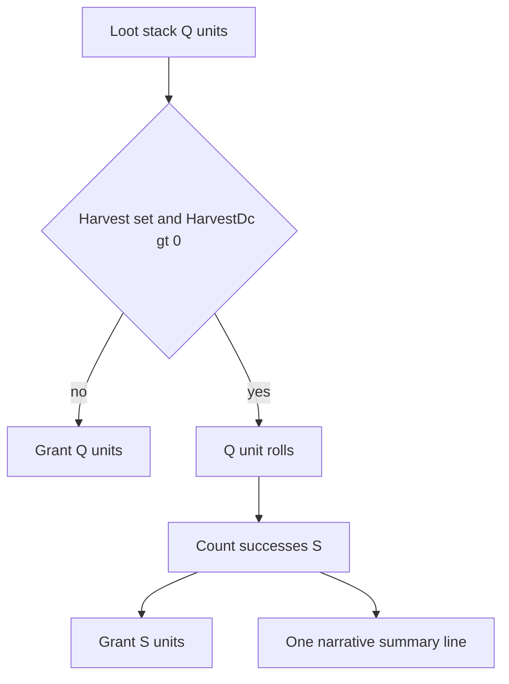

# Per-item harvest checks on loot stacks

## Domain type and naming

**[`HarvestRequirement`](e:\DevProjects\Godot\the-dungeon\Scripts\0.Core)** (dumb data in Core, alongside [`LootableItemDefinition`](e:\DevProjects\Godot\the-dungeon\Scripts\0.Core\Inventory\LootableItemDefinition.cs)):

```csharp
public sealed class HarvestRequirement
{
    public int HarvestDc { get; set; }
    public AbilityScore HarvestAbility { get; set; }
}
```

- **`HarvestDc <= 0`** on the requirement (or **`Harvest` absent** on the loot stack): treat as **no harvest** — grant immediately like today.
- **`HarvestDc > 0`:** use **`HarvestAbility`** for the modifier on each check.

**[`LootableItemDefinition`](e:\DevProjects\Godot\the-dungeon\Scripts\0.Core\Inventory\LootableItemDefinition.cs):** optional **`HarvestRequirement? Harvest`** (`null` = no harvest).

## Godot: sub-resource on `LootableItemResource`

- Add **`[GlobalClass]`** **`HarvestRequirementResource : Resource`** (or equivalent name) with **`[Export] int HarvestDc`** and **`[Export] AbilityScore HarvestAbility`**, intended for **inline sub-resource** editing on each loot entry.
- **`LootableItemResource`:** **`[Export] HarvestRequirementResource? Harvest`** (nullable).
- **[`LootableItemMapper`](e:\DevProjects\Godot\the-dungeon\Mappers\LootableItemMapper.cs):** map sub-resource → domain **`HarvestRequirement`** when present and meaningful.

No agent edits to `.tres` / serialized stacks — you assign sub-resources in the editor.

## Terminology (surgical only)

- **Scope:** Change wording only where it describes **LootableItemControl items in the container loot grid** / that picker — **not** a repo-wide removal of the word “row” (e.g. backpack grid, unrelated APIs stay as-is).
- **Implementation pass:** grep/read comments in **overlay / container loot / `ContainerLootInteractionService` / `LootableItemControl`** and align language (**content index**, **stack**, **LootableItemControl index**) where it refers to that UI.
- **DTO / API names:** Renaming **`ContainerLootPanelDto.Rows`** / **`RowIndex`** is **optional** and potentially breaking; prefer **updating XML comments** on [`ContainerLootStackRowDto`](e:\DevProjects\Godot\the-dungeon\Scripts\3.Game.Contracts\Inventory\ContainerLootStackRowDto.cs) to clarify “one entry per **stack** in `Contents`” without renaming properties unless you explicitly want a follow-up rename.

## Rolls: one per unit, one narrative summary per stack

For each loot **stack** being transferred that has a harvest requirement with **`HarvestDc > 0`** and quantity **`Q`**:

1. Run **`Q` independent checks** (same DC and ability each time): d20 + ability modifier vs **`HarvestDc`**.
2. Let **`S`** = count of successes (respect existing critical success/fail rules from [`ResolutionService`](e:\DevProjects\Godot\the-dungeon\Scripts\3.Game\Services\ResolutionService.cs) if applicable).
3. **Grant `S`** units to inventory (partial success); **`Q − S`** units are **lost** (destroyed), not returned to the container.
4. **Narrative:** **one** primary game-log outcome per stack — a **single summarized line** describing the overall harvest attempt (e.g. successes vs failures / net quantity gained), **not** one narrative line per unit roll. Optionally embed compact roll detail in that summary or attach **one** [`LogEntryKind.Roll`](e:\DevProjects\Godot\the-dungeon\Scripts\2.State\) entry whose detail text aggregates all dice/mod outcomes for that stack (implementation detail: keep UI readable and low-noise).

Stacks **without** a harvest requirement behave as today (full quantity moves).

## Removal: corpse / monster-level HarvestDc

Remove obsolete global corpse DC (per-item replaces it):

- [`MonsterDefinition`](e:\DevProjects\Godot\the-dungeon\Scripts\0.Core\Monster\MonsterDefinition.cs), [`CorpseFeature`](e:\DevProjects\Godot\the-dungeon\Scripts\0.Core\Dungeon\CorpseFeature.cs), [`MonsterResource`](e:\DevProjects\Godot\the-dungeon\Resources\MonsterResource.cs), [`MonsterMapper`](e:\DevProjects\Godot\the-dungeon\Mappers\MonsterMapper.cs), [`CombatCorpseHelper`](e:\DevProjects\Godot\the-dungeon\Scripts\3.Game\Services\CombatCorpseHelper.cs), [`ExplorationService`](e:\DevProjects\Godot\the-dungeon\Scripts\3.Game\Services\ExplorationService.cs) inspect line — plus tests that only asserted corpse **`HarvestDc`**.

You clear old monster resource fields in the editor.

## Panel DTO: surface harvest for UI

Extend **[`ContainerLootStackRowDto`](e:\DevProjects\Godot\the-dungeon\Scripts\3.Game.Contracts\Inventory\ContainerLootStackRowDto.cs)** so each stack can show requirement text:

- e.g. **`int? HarvestDc`** and **`AbilityScore? HarvestAbility`**, both null when no harvest — **or** a small nested read-only DTO mirroring **`HarvestRequirement`**.
- **[`ContainerLootInteractionService.TryBuildPanel`](e:\DevProjects\Godot\the-dungeon\Scripts\3.Game\Services\ContainerLootInteractionService.cs):** fill these from each **`LootableItemDefinition.Harvest`** when building the list.

**Godot:** Wire **`LootableItemControl`** / overlay to display DC + ability using existing export patterns ([`LootableItemControl.Configure`](e:\DevProjects\Godot\the-dungeon\Scenes\Components\LootableItemControl.cs) extension + inspector steps — **you** adjust `.tscn` per repo rules; agent supplies C# parameters/data only).

## Transfer pipeline

- **[`ContainerLootOperations`](e:\DevProjects\Godot\the-dungeon\Scripts\3.Game\Services\ContainerLootOperations.cs):** inject **`ResolutionService`**; implement per-unit resolution + partial quantity grant + summarized narrative; keep **content-index** language in new/edited comments for this flow.
- **[`ContainerLootInteractionService`](e:\DevProjects\Godot\the-dungeon\Scripts\3.Game\Services\ContainerLootInteractionService.cs)** + **[`GameRoot.cs`](e:\DevProjects\Godot\the-dungeon\Scenes\GameRoot.cs)** DI.

## Tests

- Mapper (sub-resource), corpse helper copy, **`ContainerLootOperations`** with seeded dice: partial success (e.g. 7 tries, fixed outcomes → 4 gained); full fail; no-harvest unchanged; remove obsolete corpse **`HarvestDc`** assertions. **`dotnet test`**.


