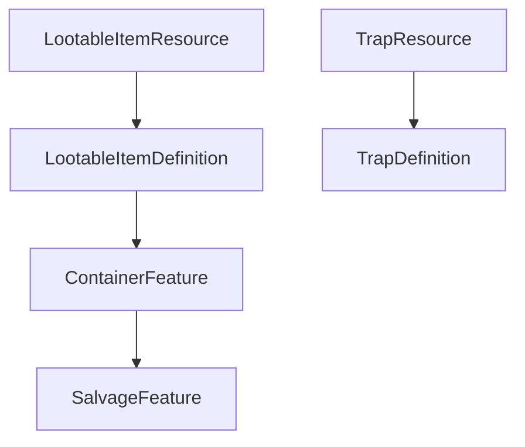

# Loot roadmap + Phase 1 (revised)

## Part A — Roadmap document

Create **[`docs/LOOT_CONTAINERS_ROADMAP.md`](e:/DevProjects/Godot/the-dungeon/docs/LOOT_CONTAINERS_ROADMAP.md)** as the durable checklist for all five phases. It must reflect:

- **Authoring pipeline:** [`LootableItemResource`](e:/DevProjects/Godot/the-dungeon/Resources/) (Godot `Resource`, `[GlobalClass]`) ↔ **[`LootableItemDefinition`](e:/DevProjects/Godot/the-dungeon/Scripts/0.Core/)** (domain), with **mappers** (same pattern as [`ItemResource`](e:/DevProjects/Godot/the-dungeon/Resources/ItemResource.cs) / [`TrapMapper`](e:/DevProjects/Godot/the-dungeon/Mappers/TrapMapper.cs)).
- **Room state:** abstract **[`ContainerFeature`](e:/DevProjects/Godot/the-dungeon/Scripts/0.Core/Dungeon/)** with subclasses **`SalvageFeature`**, **`CorpseFeature`**, **`ChestFeature`** so type-specific fields (e.g. chest **locked**, corpse **harvest DC**) live on the right type; shared **`RemoveFeatureWhenEmpty`** on the base (salvage often `true`, corpses often `false` for flavor—data-driven per instance).

| Phase | Goal | Exit criteria |
|-------|------|-----------------|
| **1 — Foundation** | Definitions + Resources + mappers for loot rows; container feature hierarchy; Game transfer + **narrative log** demo; tests | Green tests; **no** forced trap→backpack grant via new API |
| **2 — Traps** | [`TrapService.ApplySuccess`](e:/DevProjects/Godot/the-dungeon/Scripts/3.Game/Services/TrapService.cs) fills **`SalvageFeature`** from **trap definition** loot list; remove **`TrapIds.Snare`** / rope special-case |
| **3 — Picker contract** | Presenter/session API + DTOs; optional stub |
| **4 — Monsters** | Death → **`CorpseFeature`**; flee/room rules when ready |
| **5 — Treasure** | Unify with **`ChestFeature`** / container model where ROI is clear |

Reference this file in future work (`@docs/LOOT_CONTAINERS_ROADMAP.md`).

---

## Part B — Phase 1 implementation (detailed)

### B1. Domain: `LootableItemDefinition` (not a bare `LootableItem` name)

Add **[`Scripts/0.Core/Inventory/LootableItemDefinition.cs`](e:/DevProjects/Godot/the-dungeon/Scripts/0.Core/Inventory/LootableItemDefinition.cs)** (or adjacent folder per existing layout):

- **`string ItemDefinitionId`** (trimmed by callers)
- **`int Quantity`** (≥ 1 at use sites; validation in operations if needed)

Dumb data only; future fields (curse, nested trap) extend **this** type.

**Tiering:** Stays in **Core** because [`RoomFeature`](e:/DevProjects/Godot/the-dungeon/Scripts/0.Core/Dungeon/RoomFeature.cs) subclasses cannot depend on `3.Game.Contracts` (Core has no upward refs).

### B2. Godot: `LootableItemResource`

Add **`Resources/LootableItemResource.cs`** mirroring [`ItemResource`](e:/DevProjects/Godot/the-dungeon/Resources/ItemResource.cs):

- `[GlobalClass]`, `partial class LootableItemResource : Resource`
- **`[Export] string ItemDefinitionId`** (or link to `ItemResource` later—**string id** matches existing treasure/item resolution patterns)
- **`[Export] int Quantity`**

No `.tres` edits in agent session; **you** attach rows in the editor when ready.

### B3. Mappers

Add **`LootableItemMapper`** (or **`LootableItemResourceMapper`**) under **[`Mappers/`](e:/DevProjects/Godot/the-dungeon/Mappers/)**:

- `LootableItemDefinition ToDomain(LootableItemResource resource)`
- `List<LootableItemDefinition> ToDomainList(Godot.Collections.Array<LootableItemResource> or IEnumerable)` — follow patterns from **[`TrapMapper`](e:/DevProjects/Godot/the-dungeon/Mappers/TrapMapper.cs)** / list mappers.

### B4. Trap authoring alignment (Phase 1 plumbing)

Extend **[`TrapDefinition`](e:/DevProjects/Godot/the-dungeon/Scripts/0.Core/Trap/TrapDefinition.cs)** with something like **`List<LootableItemDefinition> DisarmLoot`** (name TBD).

Extend **[`TrapResource.cs`](e:/DevProjects/Godot/the-dungeon/Resources/TrapResource.cs)** with **`[Export] Array<LootableItemResource> DisarmLoot`** (or `SalvageLoot`).

Update **[`TrapMapper`](e:/DevProjects/Godot/the-dungeon/Mappers/TrapMapper.cs)** to map that array → definition list.

**Phase 2** will **consume** this on disarm; Phase 1 only guarantees **types + mapper path** so assets compile conceptually.

### B5. Container feature hierarchy (Core)

Replace the earlier “single `ContainerFeature` enum” sketch with:

| Type | Role |
|------|------|
| **`ContainerFeature`** (abstract) | Shared: **`List<LootableItemDefinition> Contents`**, **`bool RemoveFeatureWhenEmpty`** |
| **`SalvageFeature`** | Disarmed trap salvage piles (baseline) |
| **`CorpseFeature`** | Monster corpses; room for future **harvest DC** etc. |
| **`ChestFeature`** | Chests; room for **locked**, future keys |

All inherit **[`RoomFeature`](e:/DevProjects/Godot/the-dungeon/Scripts/0.Core/Dungeon/RoomFeature.cs)**. Specialized properties stay **only** on subclasses.

Transfer logic (B7) should accept **`ContainerFeature`** (polymorphic) so one path serves all.

### B6. Inventory quantity handling

[`InventoryState`](e:/DevProjects/Godot/the-dungeon/Scripts/2.State/Player/InventoryState.cs) today emphasizes **`AddOrStackOne`**. Add **`AddOrStack(ItemDefinition def, int quantity)`** (or loop) respecting **`MaxStackSize`**, matching spirit of **[`TreasurePickupService`](e:/DevProjects/Godot/the-dungeon/Scripts/3.Game/Services/TreasurePickupService.cs)** + proficiency recompute at operation boundary.

### B7. Game: transfer + **narrative log demo**

Add a small API under **`Scripts/3.Game/Services/`** (static helper or service):

- Resolve each `LootableItemDefinition` via **`IItemDefinitionRepository`**
- Transfer with **`PlayerProficiencyAggregationService.Recompute`** after changes (treasure pattern)
- Remove drained rows / optional remove empty feature via **`RemoveFeatureWhenEmpty`**

**Log-only UX (explicit request):** extend **[`NarrativeService`](e:/DevProjects/Godot/the-dungeon/Scripts/3.Game/Narrative/)** with lines for:

- Successful take per item (reuse/align with [`ForTookItem`](e:/DevProjects/Godot/the-dungeon/Scripts/3.Game/Narrative/NarrativeService.GameOverAndItems.cs) where appropriate)
- Unknown/missing definition id (mirror treasure “no definition” tone)
- Optional one-line summary when opening/taking from a container (keep short for log spam)

Expose a **testable** entry point that performs transfer + logging (no new Godot scenes in Phase 1).

### B8. “Peek capacity” (minimal)

Keep lightweight estimate using **[`InventoryBackpackGridModel.BuildUnequippedRows`](e:/DevProjects/Godot/the-dungeon/Scripts/3.Game/Inventory/InventoryBackpackGridModel.cs)** + `maxSlots` — document limitations; full picker resolves in Phase 3.

### B9. Tests

[`Tests/TheDungeon.Tests`](e:/DevProjects/Godot/the-dungeon/Tests/TheDungeon.Tests): transfer all / partial; missing id; stack caps; **`SalvageFeature` vs `CorpseFeature`** behavior only where it differs (e.g. remove when empty defaults).

### B10. Out of scope for Phase 1 execution

- Changing **[`TrapService`](e:/DevProjects/Godot/the-dungeon/Scripts/3.Game/Services/TrapService.cs)** success path to spawn salvage (**Phase 2**), unless you explicitly fold a thin hook in—default **defer** to keep PR focused.

---

## Verification

- `dotnet build` / `dotnet test` on **TheDungeon.Tests**
- **No** edits to **`*.tscn` / `*.tres`** (serialized scenes/resources)

---

## Dependency sketch

